# Colouring Sequences (leaf example)

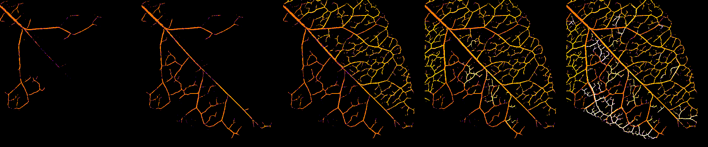

## What you'll need

* Stack of processed (and cleaned) images - see the [processing instructions](./instructions.md)
* Fiji version of ImageJ - [https://fiji.sc/](https://fiji.sc/)
* OpenSourceOV ImageJ Toolbox - download the latest version from  [https://github.com/OpenSourceOV/imagej-scripts/archive/master.zip](https://github.com/OpenSourceOV/imagej-scripts/archive/master.zip). Follow the instructions at [https://github.com/OpenSourceOV/imagej-scripts](https://github.com/OpenSourceOV/imagej-scripts) to install the toolbox in Fiji (don't forget to restart Fiji).

## Instructions

1. Open the stack of processed images in Fiji. Select the threshold tool from the Image > Adjust > Threshold... menu. Adjust the threshold until the embolism pixels are highlighted (usually red).

    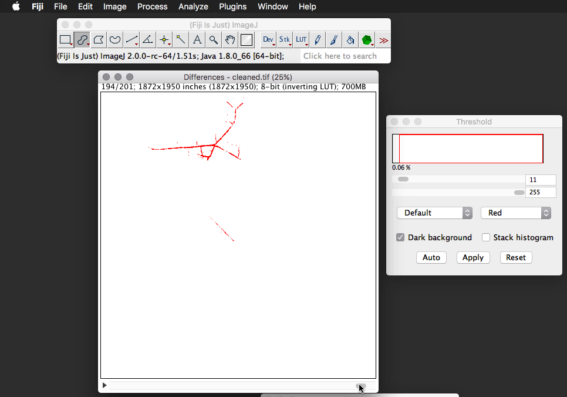

2. From the OSOV Toolbox select the Colour Slices function. If the green toolbox icon isn't there then click the >> icon and select 'OSOV Toolbox' from the list. See the [processing guide](./instructions.md) for more info.

    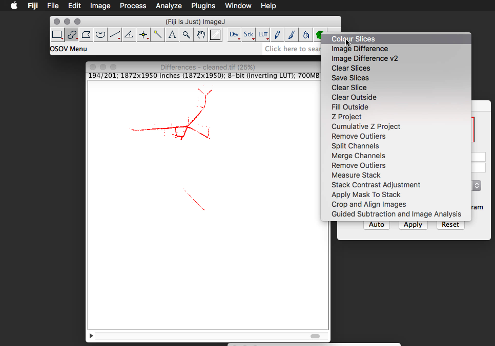

3. Under the scale option select 'Slice'. This will divide the LUT color range by the number of slices i.e. distribute the LUT colour range across the entire sequence regardless of which slices contain embolism. Select 'Cavitation Events' to ignore empty slices.

    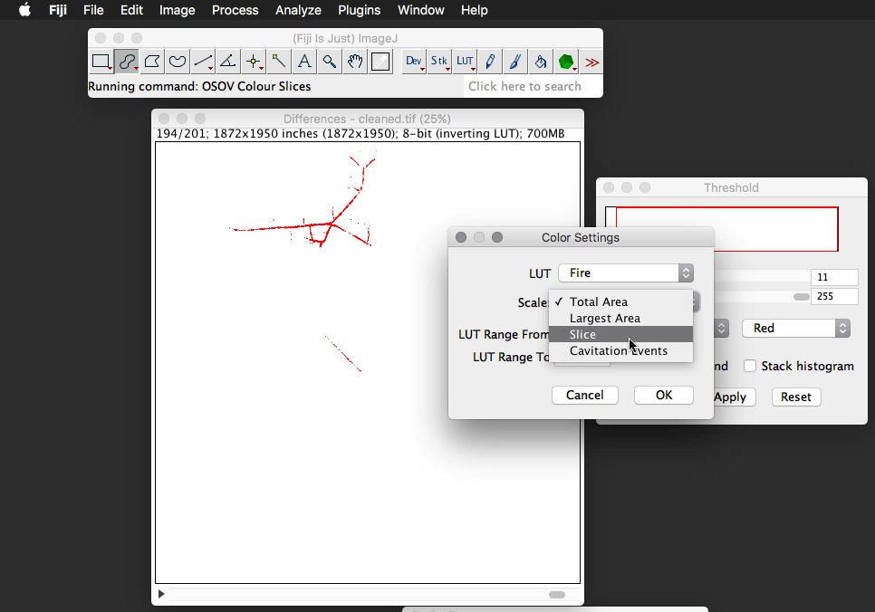

4. Once the function has completed use the Z Project tool in the OSOV toolbox to overlay all the slices.
    
    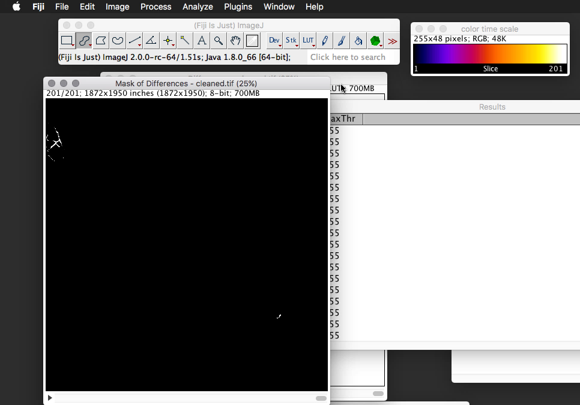
    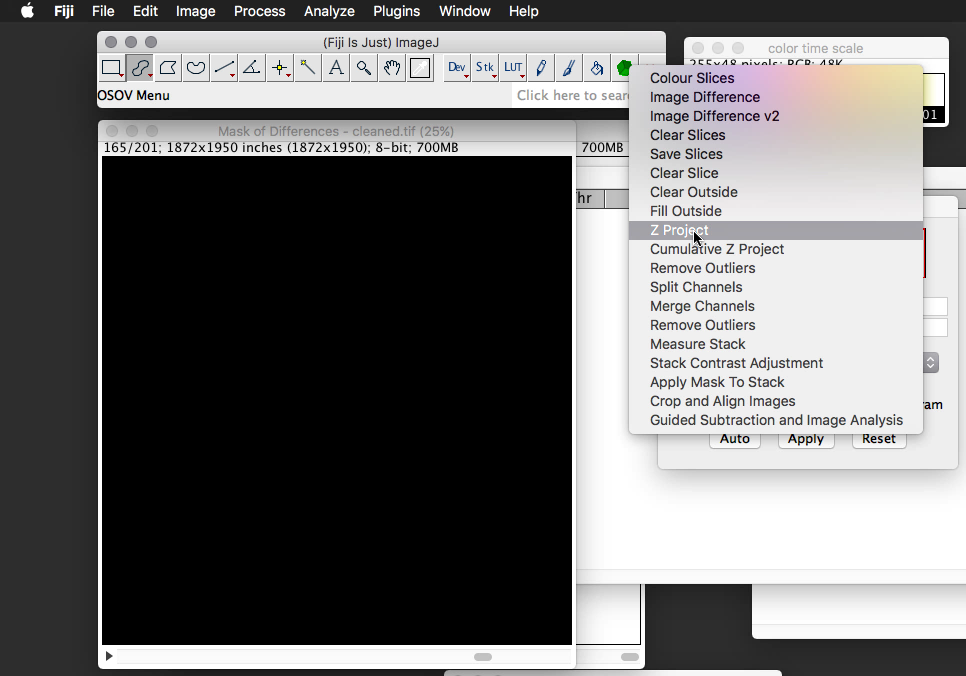
    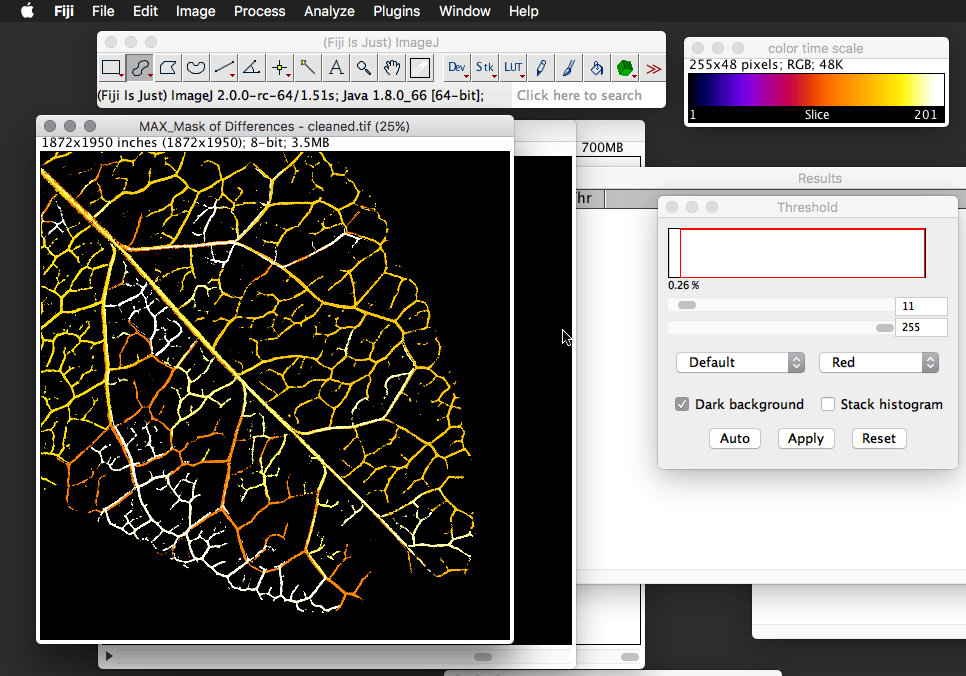

5. This is nice but the problem with a single Z stacked image is many of the events are overlaid i.e. it's difficult to see the progression of events. Instead let's close that image and use the 'Cumulative Z Project' function.

    
    
6. The Cumulative Z Project function will progressively add each layer so the events sequentially build. 

  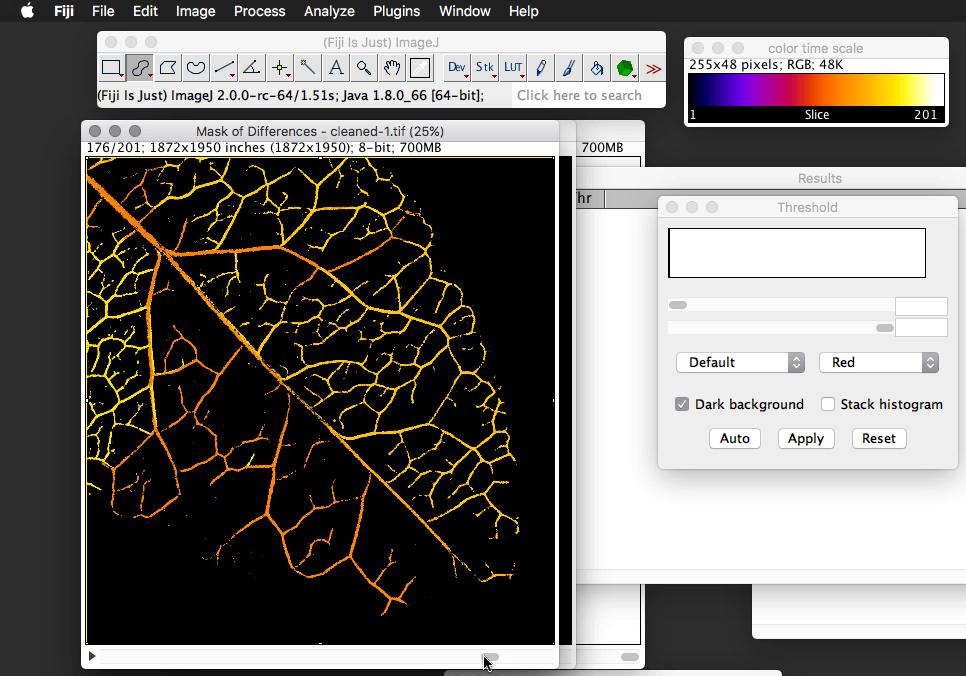

7. Scroll through the stack and note the number of a few key slices that demonstrate the progression of events. The slice number can be found at the top left of the stack window e.g. 24/534 = slice number 24. 
  
8. From the Stacks > Tools menu select the 'Make Substack...' function and enter a comma-separated list of the slice numbers from the previous step and press OK.

  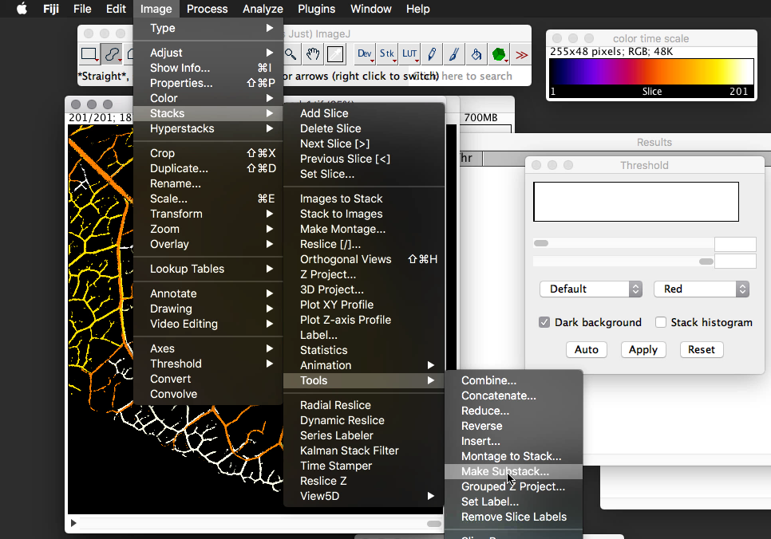
  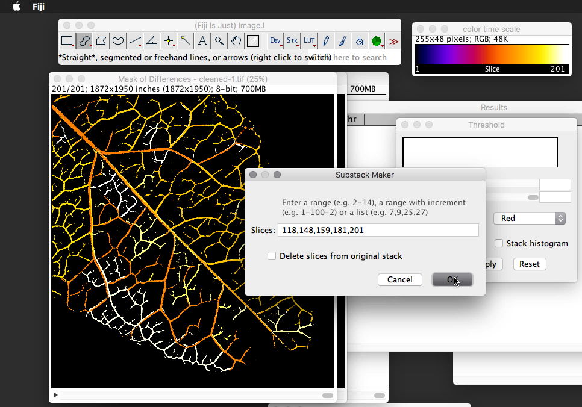
  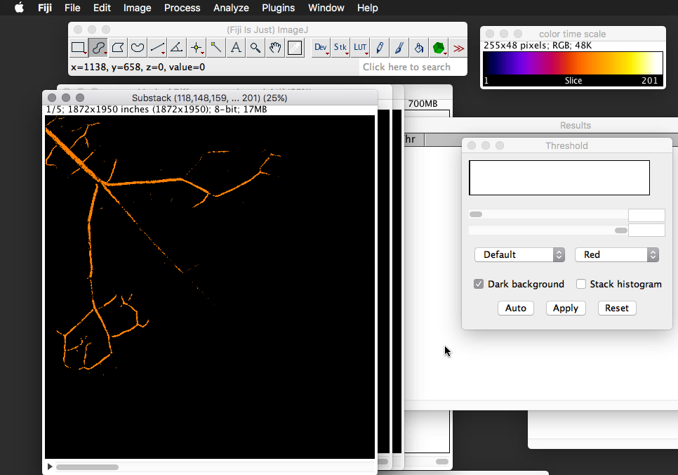

9. Make a montage of the resulting stack
  
  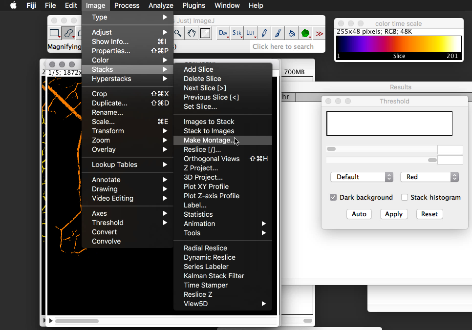
  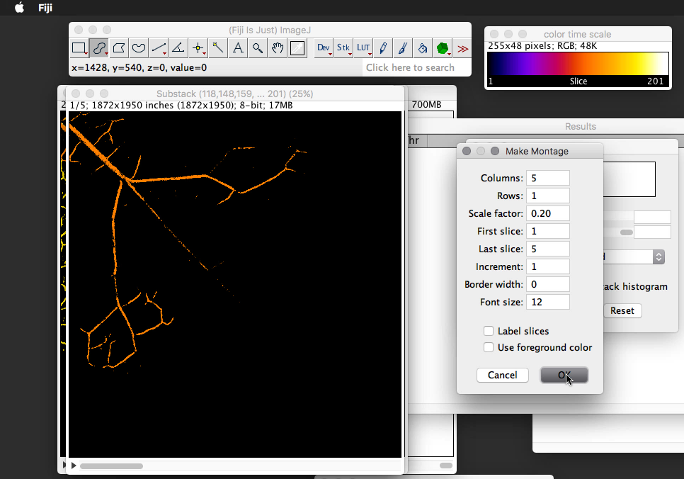

10. Done!
  
  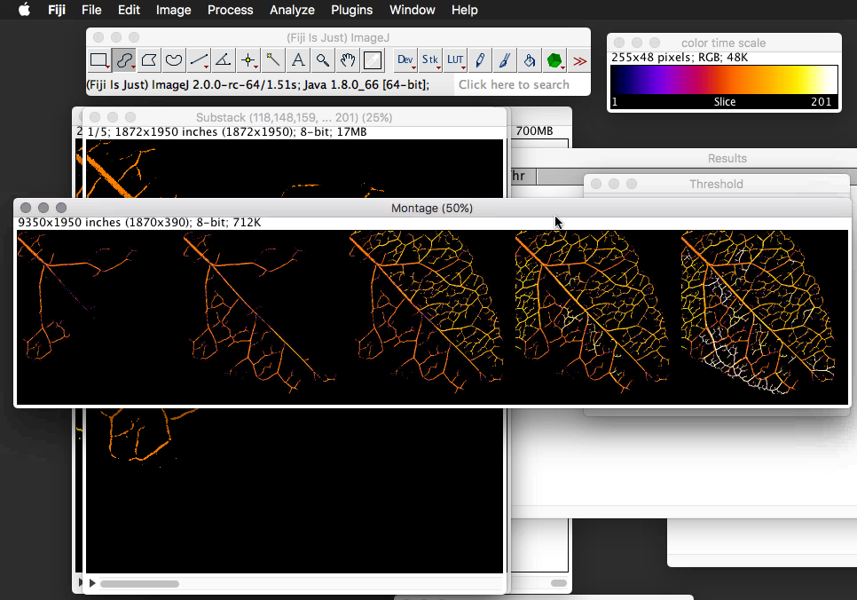

11. Check out [Colouring Sequences (stem example)](./colouring-stem-sequences.md) for instructions on adding a background to the figure.