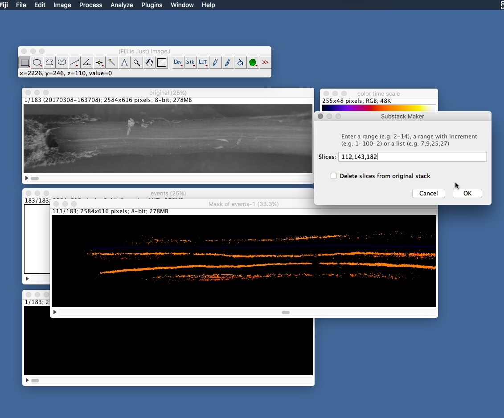
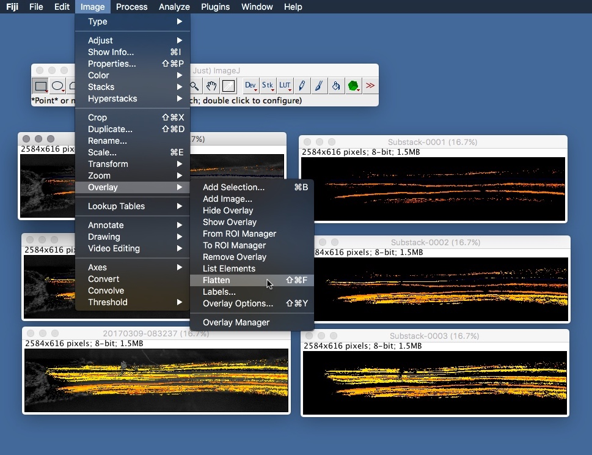

# Colouring Sequences (stem example)

Often you will want to display event sequences in periods of time or water potential: 

## What you'll need

These instructions assume you have processed your sequence of images by following the [processing guide](./instructions.md). After following the processing guide you should have two stacks: 1 containing the original images and 1 containing the processed events.

* Stack of original images
* Stack of processed images
* Fiji version of ImageJ

## Instructions

1. Open the stack of original images and the stack of processed events in Fiji. Use the cursor keys to size the stack windows so you can easily see everything.

    

2. Threshold the event pixels. Select the events stack then scroll through the stack until you find a slice that contains an event. From the **Image** menu select **Adjust > Threshold...** and adjust the sliders until the event is highlighted (usually a red colour).

    

3. Ensuring that the event stack is still selected (just click the top bar of the events stack window), from the OSOV plugin menu select **Colour Slices**

    
  

4. From the Color Settings dialog select **Slice** from the Scale option. 

    **What does Colour Slices do?**

    As the name suggests, the Colour Slices function colours the non-zero areas of each slice in the stack according to the options in the dialog. In fact what it's really doing is dividing the slices into the 8bit grayscale range (0-255) and then applying an LUT. The options are:

    Option | Description
    ---------|------
    LUT|The LUT applied to the stack. Once the final stack has been produced you can change this via the **Image > Lookup Tables** menu option. Note: 'Area' is sum of non-zero pixels
    Scale|*Total area* = area of each slice / sum of areas stack * 255
    ...|*Largest area* = area of each slice / largest area * 255
    ...|*Slice* = slice number / number of slices * 255
    ...|*Cavitation events* = Same as Slice option except slices with zero areas are excluded
    LUT Range From & LUT Range To|Adjust these values to modify the LUT range e.g. LUT Range From = 200, LUT Range To = 255. This is useful if, for example, you have a sequence spread over multiple stacks and need to apportion the 255 LUT range between them.

    
    
5. The Colour Slices function will create what looks like an empty stack with the title 'Mask of...'. Now run the Z Project function from **Image > Stacks > Z Project...** and select **Max Intensity** for the projection type. This will overlays all the slices together in a single image, ignoring any black pixels. 

    If you can see all events in this composite image then you can skip to step 8 and just use a single image from the original stack, but if later events are masking earlier events, and it's difficult to see the progression of events, then continue with the following steps to break up the stack into sections.

    
    
    

6. Close the composite image created by Z Project. From the OSOV plugin menu run the **Cumulative Z Project** option. Instead of creating a single final composite image this function effectively Z Projects each slice i.e. each slice becomes a composite of all the slices before it. 

    

7. From the new stack we can now make a selection of slices to show the progression of events over time.

    Which slices you choose depends on what you want to show but two obvious options are events over time or events by water potential. For example, say your captured sequence runs for 6 hours and over a water potential range 1-3 MPa you could pick 3 slices that represent events at hours 2, 4, and 6 or at water potentials 1, 2, and 3.

    In either case you'll need to calculate a value (water potential or time) per slice so you can determine which slices are required. Use the regression parameters calculated in [OpenSourceOV/analysis-instructions](https://github.com/OpenSourceOV/analysis-instructions) to derive either.
    
    Once you've determined the relevant slice numbers, create a new stack containing only those slices by applying the **Image > Stacks > Tools > Make Substack...** function and entering the slice numbers seperated by a comma.

    
    

8. Now we are going to overlay the processed images on the original images and to do that we need the corresponding slices from the original stack (the original captured images). Open the stack containing the original images (if it isn't open already). 

    The processed images stack is created by subtracting pairs of images which means it has one less slice than the original stack. So to select the same slices from the original stack you'll need to remove the first slice. Scroll to the first slice in the original stack and then run **Image > Stacks > Delete Slice** (step not shown below). The original stack and the processed image stack should now have the same number of slices.

    Now create a new substack with the relevant slices from the original stack by using the **Make Substack...** function and entering the same sequence of slice numbers.

    

9. You should now have two new stacks: one that contains slices from the original sequence and another that contains the same slice numbers from the processed stack. Save and close all other windows so just these two stacks remain.

    

10. For each of the stacks select **Image > Stacks > Stack to Images** to convert the stack into individual images.
    
    
    

11. It is helpful to now arrange the images in the appropriate pairs - the original image and the corresponding processed image.
    
    

12. Select the window containing the first original image (by clicking the header bar). From the menu run **Image > Overlay > Add Image...** and select the corresponding processed image from the **Image to add:** dropdown and ensure that **Zero transparent** is checked. Other options as shown. Click **OK**.
    
    

13. Do the same for the other image pairs.
    
    

14. You may need to adjust the brightness/contrast of the original image to make the processed overlay stand out. Select the composite image and select **Image > Adjust > Brightness/Contrast...** from the menu. Adjusting these values should only adjust the background original image, not the overlay. If it does then make sure you are using the Fiji version of ImageJ.

    

15. For each of the new composite images select **Image > Overlay > Flatten** from the menu. This will create a new flattened composite image.
    
    
    

16. Save and close all the other composite images except the new flattened images.
    
    

17. From the menu select **Image > Stacks > Images to Stack**. This will move all opened windows into a single stack. Scroll through and make sure the slices are in the correct order. If they aren't then select **Image > Stacks > Stack to Images**, save each image somewhere, close all images and re-open each image in ImageJ *in the correct order*. Now run the Images to Stack function again.
    
    
    
  
18. Create a montage of the slices in the stack. First set the foreground color in the color picker to black by clicking the color picker icon and then changing the colour of the foreground colour. Now select **Image > Stacks > Make Montage...** from the menu and choose an appropriate arrangement of rows and columns and give the images some space by adjusting the border width (2 seems to work well). Ensure the **Use Foreground Color** option is checked. 
    
    
    
    

19. Done! Open the image in photoshop or sketch to add the colour scale and other notations.

    
    