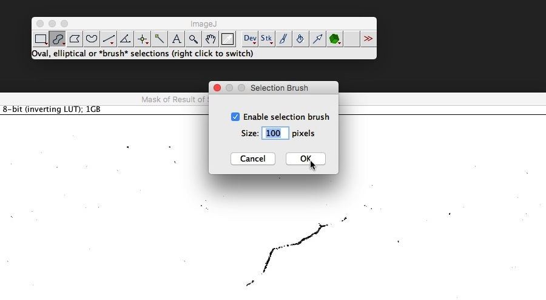

# Image Processing

## What you'll need

Requirement | Additional information
---------|---------
Folder of captured images|
Computer|With at least 4GB of RAM and a dual-core processor - see [Memory Requirements](#memory-requirements) for more information
ImageJ version 2| Download from [https://imagej.net/ImageJ2](https://imagej.net/Downloads)
OpenSourceOV ImageJ scripts|Download the latest version from  [https://github.com/OpenSourceOV/imagej-scripts/archive/master.zip](https://github.com/OpenSourceOV/imagej-scripts/archive/master.zip)

Before you start we recommend you read the [Memory Requirements](#memory-requirements) section to understand the memory requirements of image processing.

## Instructions

1. Follow the [ImageJ Installation Instructions](https://imagej.net/Downloads#Installation) to install ImageJ.

2. Follow the instructions at [https://github.com/OpenSourceOV/imagej-scripts](https://github.com/OpenSourceOV/imagej-scripts) to install the OSOV Toolbox in ImageJ (don't forget to restart ImageJ).

3. Import the captured images as a stack using the Import > Image Sequence function. Select the "Convert to 8-bit Grayscale" option.

    

    

4. Load the OSOV Toolbox by clicking the '>>' icon to the right of the toolbar and selecting 'OSOV Toolbox'.
    
    

5. Crop the image as necessary

    

6. The OSOV Toolbox icon (green cube) will appear on the toolbar menu. Click the icon and choose the **Image Difference** function. Convert the resulting stack of image differences to an 8-bit image using the Image > Type > 8-bit function from the menu.
    
    

7. Apply an automatic contrast to the result stack to enhance the detail. From the Image > Adjust menu select 'Brightness/Contrast...' then click the 'Auto' button. For some sequences where the differences are obvious this step isn't required.

    

    

8. Run through the stack (using the scroll bar at the bottom of the stack window) to find a stack slice with a cavitation event. In this case most vein orders rapidly embolised within a single 5 minute interval (1 slice of the stack).

    

9. Use the Image > Adjust > Threshold... tool to select as many of the pixels representing embolism as possible. If auto-thresholding is preferred then the intermodes method works well for some images. Note however that at this stage it will not be possible to exclude noise and non-embolism events from thresholding. These will be removed later. The goal at this stage is simply to extract as many of the pixels we're interested in as possible.

    

    

10. Run the Analyze > Analyze Particles... function from the menu setting the Size option to '0-Infinity', Circularity to '0.00-1.00' and the Show option to Masks. In effect this copies all the pixels we're interested in to a new binary stack (all pixels set to black). 

    

    

11. Remove the random noise in the new stack by running the Process > Noise > Remove Outliers... function from the menu. Set the Which outliers option to Dark. The Radius and Threshold options can usually be left as is but check the Preview option and increase/decrease the Radius option to determine an optimum value.

    

    

    

12. Manually remove any remaining noise and artifacts

    See the section below on [Manually removing noise and artifacts](#manually-removing-noise-and-artifacts)

15. Measure embolism total area per slice.

    **Set the scale to 1:1** i.e. scaled to the pixel resolution. The unit of length is pixel but can be left as unit.

    
    
    

    **Set measurements options** 
    
    Select Area as a measurement and select the Limit to Threshold option.

    

    

    **Apply a threshold to select the black pixels**

    Using the Image > Adjust > Threshold... tool select all black pixels (adjust the sliders until all the pixels are red highlighted)

    

    **Measure**

    From the OSOV Toolbox select 'Measure Stack'

    

16. Save the Results to a file for analysis.

    

17. Done!

## Memory Requirements

When importing a sequence of images using the Import > Image Sequence function ImageJ will load all the images into the computer's RAM. So if you have 100 images that are 2MB each you will need a total of 200MB of available RAM. Most modern computers have around 2-4GB of RAM or 2000-4000MB so 200MB is fine.

Once the images are loaded you will need at least 4 or 5 times the memory to run the Image Difference script which creates two duplicates of the stack (to subtract one from the other) and creates a third 32-bit stack which is much larger still.

A typical sequence might contain 1000+ images at 7MB each, so 1000 x 7 = 7000MB or 7GB which will require more RAM than most computers have installed by default. 

If you run out of memory there are a few options:

### Increase ImageJ memory allocation**

From the Options menu choose **Memory & Threads...** and check the maximum memory value and increase up to ~80% of the RAM of the computer.

### Install more RAM

RAM is relatively cheap and with most computers you can upgrade to 8GB, some up to 30GB depending on the motherboard. 

### Process the sequence in sections

Use the 'Starting image' and 'Number of images' option in the Sequence Options dialog that appears when initiating a sequence import. For example, to import images 1-100 set the Number of images to 100 and leave Starting image at 1. To import images 200-300 set Number of images to 100 and the Starting image to 200 and so on. 

### Reduce the size of the images

In most cases a super high resolution image is not required and you can reduce the size of the images by anywhere up to 50%. Make the reduction when importing the sequence in the Sequence Options dialog by changing the 'Scale images' option. 

### Crop the stack

Crop the stack to minimise the number of pixels that require processing. In this case there are a lot of pixels around the sample that don't need processing and can be cropped out. 

### Process a sub region

Run the Image Difference tool with a region selected using the rectangle tool to process only a region of the image. This can be useful if a good distribution of vein orders can be found within region.

### Use a virtual stack

Instead of loading every image in the sequence into memory the images can be imported alternatively as a **Virtual Stack**. The advantage is that each image is only loaded into memory as required and the stack loads instantly. The disadvantage is that scrolling through the sequence (using the scrollbar at the bottom of the stack window) becomes slow and halting as each image is loaded and unloaded.

The Image Difference function can be applied to a virtual stack, however this function will still perform the same internal duplication of the stack created 2 non-virtual stacks in addition to the third new differences stack. So by using a virtual stack you only reduce the memory by the size of 1 stack. 

Using a virtual stack works best when processing a sub region (as described above) and a typical workflow would be to apply the Image Difference to several regions (but one at a time) to determine the best distribution of events in the sequence.

The virtual stack option can be enabled in the Sequence Options dialog by selecting the 'Use Virtual Stack' checkbox.

## Manually removing noise and artifacts

Outlier removal will remove almost all the randomly distributed noise but there will be groups of non-random pixels remaining that must be removed manually. These are typically the result of leaf shrinkage, sample movement (e.g. being knocked) and insects walking across the sample during a capture. If banding is visible this may be caused by 'voltage ripple', an artifact of the AC to DC power convertion in the power adapter that supplies current to the LEDs. Check the regulated power supply or switch to a battery. 

There are four tools in the OSOV Toolbox to expedite the process of manual cleaning:

* **Clear Slice** - removes everything from the current stack slice (image)
* **Clear Slices** - removes everything from slices in the slice number range provided. The slice number is displayed at the top of the stack window.
* **Save Slices** - will clear all slices *except* the slices specified in the comma-separated list.
* **Clear Outside** - will clear everything outside the area currently selected. This tool is best used with the Selection Brush set to ~100 pixels. Select all the events on the image then use Clear Outside to remove everything else. Note this works differently to the ImageJ Clear Outside function under the Edit menu.

    To choose the selection brush tool right-click the Oval icon on the toolbar and select Selection Brush Tool.

    
    
    Double-click the Selection Brush Tool to set the tool options.

    

    Trace around the events. Use the Shift or Alt(Command key for Apple) to add or remove selections.

    
    
    From the OSOV Toolbox choose the Clear Outside function.

    
    

### Workflow

The first thing to do is arrange all three windows - the original stack, the image difference stack and the extracted pixels stack (the one to be processed) - and synchronise them so as you progress through one they all advance for easy comparison.

Starting at the first slice work your way through the stack checking the difference stack to ensure that you're only removing artifacts and noise, not embolism events. 

To streamline the workflow set the four cleaning tools as keyboard shortcuts using the Plugins > Shortcuts > Add Shortcut... function. Used in combination with cursor keys to move between slices shortcuts can significantly reduce the total processing time.

