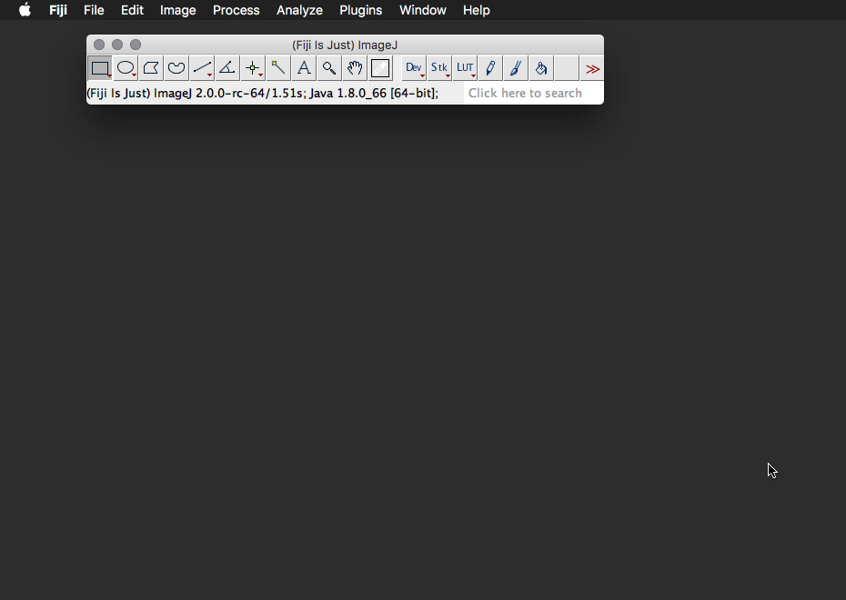
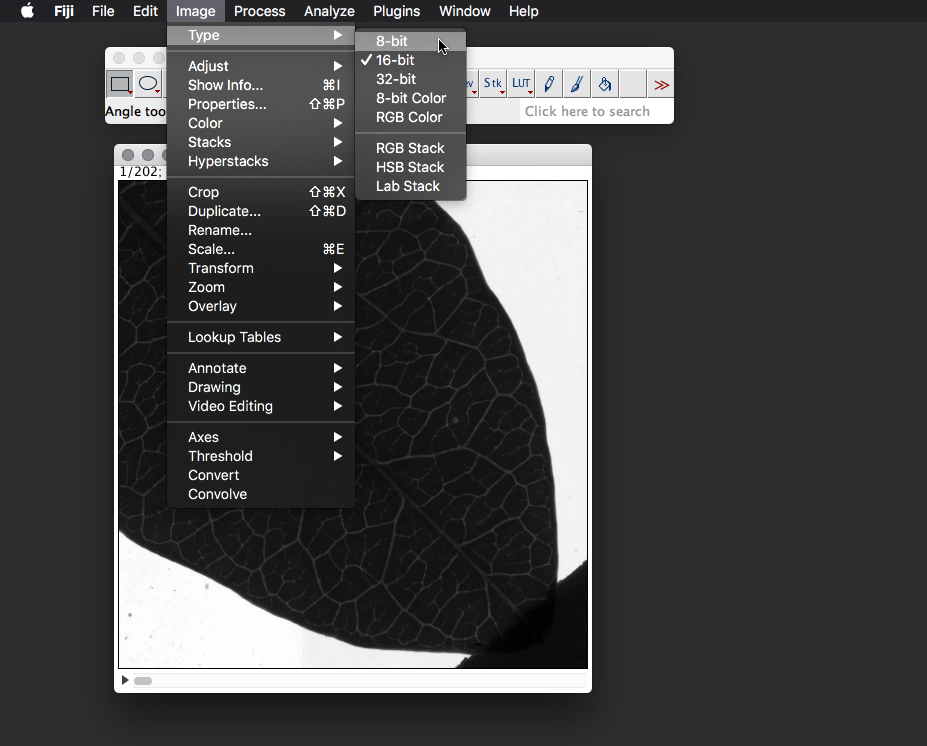
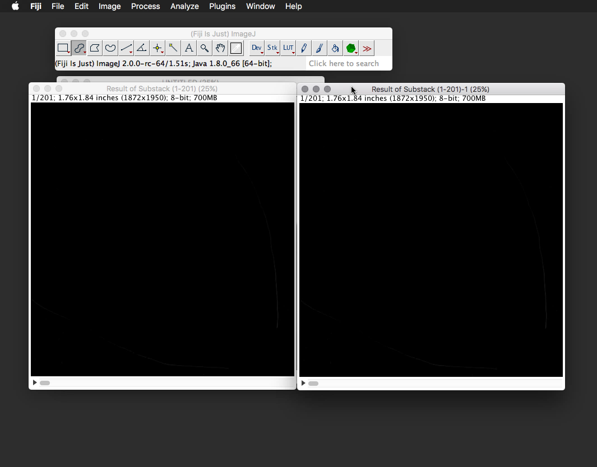
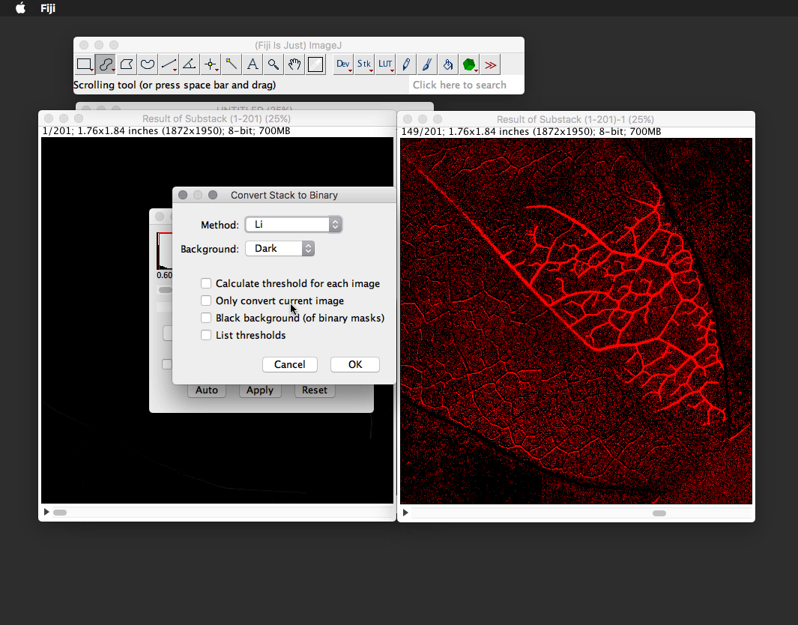
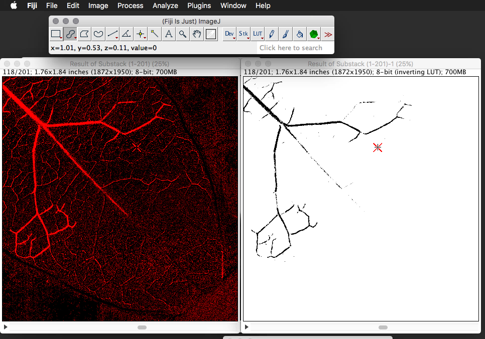

# Image Processing

## What you'll need

* Folder of captured images
* Computer with at least 4GB of RAM and a dual-core processor
* Fiji version of ImageJ - download from [https://fiji.sc/](https://fiji.sc/)
* OpenSourceOV ImageJ Toolbox - download the latest version from  [https://github.com/OpenSourceOV/imagej-scripts/archive/master.zip](https://github.com/OpenSourceOV/imagej-scripts/archive/master.zip)

Before you begin read the [Memory Requirements](#memory-requirements) section to understand the memory requirements of image processing.

## Instructions

1. Install and open Fiji.

  

2. Follow the instructions at [https://github.com/OpenSourceOV/imagej-scripts](https://github.com/OpenSourceOV/imagej-scripts) to install the OSOV Toolbox in Fiji (don't forget to restart Fiji).

3. Import the captured images as a stack using the Import > Image Sequence function. 

    

    

    Depending on the image size and number of files you may need to scale the images and/or check the option to Convert to 8-bit on import. See [Memory Requirements](#memory-requirements) for more information.

5. If you didn't choose to Convert the images to 8-bit on import then convert the stack to 8-bit now.
    
    

4. Load the OSOV Toolbox by clicking the '>>' icon to the right of the toolbar and selecting 'OSOV Toolbox'. The OSOV Toolbox icon (green cube) will appear on the toolbar menu.
    
    

    

6. Click the green OSOV Toolbox icon and choose the **Image Difference v2** function. Select whether you are processing a leaf (for transmitted light) or stem (reflected light).
    
    

6. The difference function will run and produce a stack that looks black with seemingly no detail. This is a stack of pixel differences between images and the differences are in most cases very small - hence the mainly black image i.e. most pixels in this stack will be low numbers (the lower the pixel value the darker it is).
    
    

7. Create a copy of the differences stack using the Duplicate function. Ensure you check 'Duplicate stack' in the options dialog.

    

    

8. Arrange the stacks side by side.
    
    

9. Now to reveal the differences. From the Image > Adjust menu select the Threshold option. 
    
    

    The threshold tool provides you with a means of selecting pixels based on their value. The box at the top of the options window is a histogram showing you the counts of pixels at different values. As you can see here most the pixels are at the very low end of the range as we would expect (since the differences in the xylem associated with embolism formation are very subtle). The red outline in the box shows you the pixel value range being thresholded (selected) and this corresponds to the values in the two input boxes undernerath which indicate that pixels are thresholded (selected) in the range 0 to 6. All pixels with those values are highlighted in the image in red.

    Remember, this is a stack of **differences**, so what the thresholding tool is doing in this case is selecting a range in magnitude of differences i.e. small difference between images are pixels closer to zero. Since we're not interested in pixels that *didn't* change - we want to see what *did* change - let's choose a more appropriate *differences* range: 2 to 255.

    

11. Now we can see events in the differences stack. Scroll through to find the clearest embolism event. 
    
    

12. We now want to extract all the pixels we're interested in and get rid of any additional information we don't need. We can either do this manually or by using a thresholding algorithm. 

    **Manual**

    In previous steps we thresholded pixels in the range 2 to 255. This is the broadest possible range of values in which embolism events might be revealed, however much of these pixel differences will be the result of noise. The bulk of noise will be in the lower end of the pixel difference range, normally 1-10. Unfortunately this range will also contain embolism events, so we can't just select pixel differences in the range 11-255 to exclude all the noise otherwise we'll lose the data as well. Additionally, the distribution of noise in that initial 1-10 range will depend on the quality of the light sensor used to capture the images. These images were captured using a high-end document scanner where the noise is typically very small. So actually for these images the range 2-255 is acceptable. For the raspberry pi clamp camera a range 6-255 is more appropriate since the range 1-6 contains a lot of noise. For material that has good light penetration and strong events - where each event results in big pixel differences, you may be able to select a higher range e.g. 10-255. 
    
    For your images you can now adjust the range to whatever is appropriate. Change the threshold range and see how it affects the embolism event revealed in the image difference. You want a balance between structure and noise: if you decrease the range you'll start to lose the structure and definition of the embolism event, but increasing the range will result in more noise coming through. A little noise is fine, we will deal with it in later steps. If you are unclear about what is noise and what are embolism events, and are concerned about introducing bias in the selection, then use the thresholding algorithm method (below).

    With an appropriate range selected you now extract those pixels using the analyze particles function of image J:

    

    Make sure the size and circularity options are as below, and under 'Show' choose 'Masks'.

    

    The effect of this function is that it will transfer all thresholded pixels to a new stack and set each of those pixels to a value of 0 (black) regardless of what the original pixel value was. This is now a binary image.

    
    
    

    Done. Now you can continue to step 14.

    **Using a Thresholding Algorithm**

    Applying a thresholding algorithm reduces selection bias because the selection of pixels is based on probabilty distributions rather than a visual estimation of the most appropriate range of pixels to select. 

    To do this choose the 'Convert to mask' tool. This will convert the image to a binary image where pixels are either 0 (black) or 255 (white).
    
    

    Now we have the option of choosing the thresholding method. Choose a method that provides the best structural resolution (i.e. least degradation of the embolism event) and least noise. A little noise is fine, we will deal with it in later steps. **IMPORTANT** Uncheck the 'Calculate threshold for each image' option.

    
    
    Not so good.
    

    This one provides the best balance between resolution and noise.
    

    Done.

14. You should now have a binary image with a white background and black pixels that represent the pixels we're interested in. If you have a black background then select Edit > Invert from the menu.

15. Synchronise the two differences stacks.

    

    Use the shift (windows) or command key (mac) to select multiple items in the list. Select the two windows corresponding to the differences stacks. Move the Synchronise Windows window out of the way (but it needs to be kept open).
    

16. Reveal the differences in the original (duplicate) stack following the same procedure for thresholding to highlight the pixel differences we're interested in.

    

17. Move the slider in either image - they should both move in sync - and find an embolism event.

    

18. Select the binary image and then from the Process menu choose Outlier removal to remove some of the remaining noise.

    

    Choose Dark pixels and adjust the radius until as much of the noise is removed without degrading too much of the original structure - compare with the original stack. A value of 1 or 2 for the radius is normal. Toggle the preview check to compare the effect.

    

    Choose OK and process entire stack.
    
    

19. Depending on the quality of the capture sequence you may at this point be done with the image processing. If there is little or no noise then continue to the next step. However, in our sequence you can still see that some non-embolism pixels remain, mostly the result of scanning artefacts and leaf shrinkage. These pixels are not randomly distributed, which makes them difficult to remove using standard noise removal techniques without distorting and affecting the pixels we want to keep. In this case we now need to manually clean the stack.

    See the section below on [Manually removing noise and artifacts](#manually-removing-noise-and-artifacts)

20. At this point you should have a clean stack. Save the stack as a tiff for backup.

    
    
21. Now sum all the non-zero pixels for each slice in the stack to give us embolism area per image. Close all windows except for the cleaned stack and from the Analyze menu select 'Set Measurements...' and ensure that Area and Limit to threshold are both checked. Press OK.

    
    
    

22. Set the scale to 1:1 i.e. 1 pixel = 1
    
    
    

23. Use the threshold hold tool to threshold the non-zero pixels i.e. only embolism events should be highlighted.

    
    

24. From the OSOV Toolbox (top right green icon) choose 'Measure Stack'.

    

25. Save the results to a file for analysis.
    
    
    

26. Done! Now...

26. [Analyse the areas to produce an optical vulnerability curve](https://github.com/OpenSourceOV/analysis-instructions)
    
    

27. [Create embolism maps and figures](https://github.com/OpenSourceOV/image-processing-instructions/blob/master/colouring-sequences.md)

    

## Memory Requirements

When importing a sequence of images using the Import > Image Sequence function ImageJ will load all the images into the computer's RAM. So if you have 100 images that are 2MB each you will need a total of 200MB of available RAM. Most modern computers have around 2-4GB of RAM or 2000-4000MB so 200MB is fine.

However, once the images are loaded you will need at least **4 or 5 times** the memory to run the Image Difference v2 script which creates two duplicates of the stack (to subtract one from the other) plus a third output stack.

So, a typical sequence might contain 1000+ images at 5MB each, so 1000 x 5 = 5000MB or 5GB and then x 4 (the original plus the three generated stacks) = 20GB! Most computers have around 4-8GB of RAM so...

If you run out of memory there are a few options:

### Increase ImageJ memory allocation

ImageJ may not be using as much of the RAM as it could be. From the Options menu choose **Memory & Threads...** and check the maximum memory value and increase up to ~80% of the RAM of the computer.

### Install more RAM

RAM is relatively cheap and with most computers you can upgrade to 8GB, some up to 30GB depending on the motherboard. 

### Process the sequence in sections

Use the 'Starting image' and 'Number of images' option in the Sequence Options dialog that appears when initiating a sequence import. For example, to import images 1-100 set the Number of images to 100 and leave Starting image at 1. To import images 200-300 set Number of images to 100 and the Starting image to 200 and so on. Make sure you select the same thresholding methods so the processing is consistent between sections.

### Reduce the size of the images

In most cases a super high resolution image is not required and you can reduce the size of the images by anywhere up to 50%. Make the reduction when importing the sequence in the Sequence Options dialog by changing the 'Scale images' option. 

### Crop the stack

Crop the stack to minimise the number of pixels that require processing. In this case there are a lot of pixels around the sample that don't need processing and can be cropped out. 

### Process a sub region

Run the Image Difference v2 tool with a region selected using the rectangle tool to process just that region of the image. This can be useful if a good distribution of vein orders can be found within a smaller area.

### Use a virtual stack

Instead of loading every image in the sequence into memory the images can be alternatively imported as a **Virtual Stack**. The advantage is that each image is only loaded into memory as required and the stack loads instantly. The disadvantage is that scrolling through the sequence (using the scrollbar at the bottom of the stack window) becomes slow and halting as each image is loaded and unloaded.

The Image Difference v2 function can be applied to a virtual stack, however this function will still perform the same internal duplication of the stack creating 2 non-virtual stacks in addition to the third new differences stack. So by using a virtual stack you only reduce memory use by the size of 1 stack. 

Using a virtual stack works best when processing a sub region (as described above) and a typical workflow would be to apply the Image Difference v2 to several regions (but one at a time) to determine the best distribution of events in the sequence.

The virtual stack option can be enabled in the Sequence Options dialog by selecting the 'Use Virtual Stack' checkbox.

## Manually removing noise and artifacts

Most noise removal techniques are excellent at removing randomly distributed noise. Often the 'Remove Outliers' function is sufficient to remove this type of noise. Non-random noise (not strictly 'noise') typically results from leaf shrinkage, sample movement (e.g. being knocked), scanning, camera or power fluctuation ('voltage ripple') artefacts and, most annoyingly, insects walking across the sample during capture. 

Although it may be possible to remove these non-embolism pixels using noise removal processes it often comes at the cost of degrading or altering the embolism 'signal', meaning embolism events become less well resolved and further from the 'real' original signal.

In this case it's better to remove as much of the random noise as possible and then deal with the non-random pixels manually by cleaning each slice one by one.

This process doesn't have to be that arduous, there are four tools in the OSOV Toolbox to expedite the process of manual cleaning and once these are linked to keyboard shortcuts you can work through a stack relatively quickly.

### OSOV Cleaning Functions

* **Clear Slice** - removes everything from the current stack slice (image)
* **Clear Slices** - removes everything from slices in the slice number range provided. The slice number is displayed at the top of the stack window.
* **Save Slices** - will clear all slices *except* the slices specified in the comma-separated list.
* **Clear Outside** - will clear everything outside the area currently selected. This tool is best used with the Selection Brush set to ~100 pixels. Select all the events on the image then use Clear Outside to remove everything else. Note this works differently to the ImageJ Clear Outside function under the Edit menu.
    

### Cleaning Workflow

1. Put the binary differences stack and the original differences stack side-by-side for comparison during the cleaning procedure.

    

2. Synchronise the two stacks so they track each other as you progress through the stack you're working on.

    
    
    Use the shift (windows) or command (mac) key to select multiple items from the list. Select the two windows relevant to the two differences stacks.

    
    
    If they are in sync you should see a cursor appear on both images.
 
    
    
    Scroll through one of the stacks to bring the stack positions into sync. They should be on the same slice number.
 
    

3. In this example stack the first 117 slices contain non-embolism pixels resulting from scanning artefacts and leaf shrinkage. We'll use the 'Clear Slices' function to bulk clear these slices.

    
    
    

    You can also do this the other way around and use the 'Save Slices' tool to select the slices you **want to keep** and then it'll clear all other slices.

4. Going through each of the remaining slices we draw around the pixels we want to keep and clear everything else. This is best done with the Selection Brush tool.

    Right-click the Oval, elliptical and brush selections icon on the toolbar and select 'Selection Brush Tool'
    
    

    Now double-click the icon again to bring up the brush size options dialog
    
    

    Set the brush size to somewhere in the 100-200 pixels range depending on the resolution of your image.

    
    
    Draw around the pixels you want to keep. 
    
    

    See the [ImageJ manual for selection tools](https://imagej.nih.gov/ij/docs/guide/146-19.html) for more information on ways to use the selection brush. For example here Alt is used to remove pixels from the selection.
    
    

5. Use the OSOV Clear Outside tool to remove everything else. Note this works differently to, and should be used instead of, the ImageJ Clear Outside function under the Edit menu.

    
    

6. Use keyboard shortcuts instead of clicking the OSOV toolbar.
    
    
    
    
    Click 'OK' then repeat the procedure to add the next shortcut.
    
    
    

7. Continue through the stack manually cleaning each slice. Always check what you are removing against the reference stack.

8. Done! 

9. Continue with processing. 